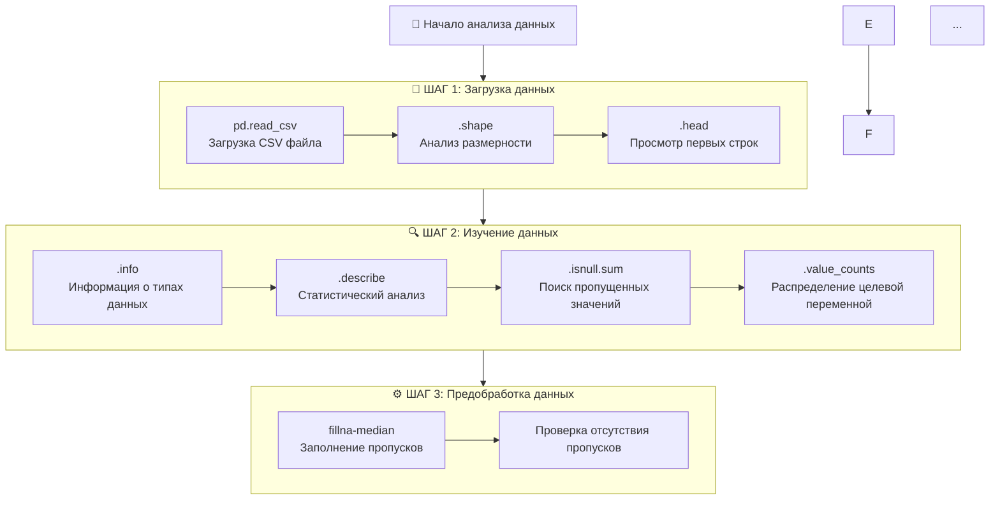

```mermaid

flowchart TD
    A[🏁 Начало анализа данных] --> B
    
    subgraph B [📂 ШАГ 1: Загрузка данных]
        B1[pd.read_csv<br>Загрузка CSV файла] 
        B2[.shape<br>Анализ размерности] 
        B3[.head<br>Просмотр первых строк]
        B1 --> B2 --> B3
    end
    
    B --> C
    
    subgraph C [🔍 ШАГ 2: Изучение данных]
        C1[.info<br>Информация о типах данных]
        C2[.describe<br>Статистический анализ]
        C3[.isnull.sum<br>Поиск пропущенных значений]
        C4[.value_counts<br>Распределение целевой переменной]
        C1 --> C2 --> C3 --> C4
    end
    
    C --> D
    
    subgraph D [⚙️ ШАГ 3: Предобработка данных]
        D1[fillna-median<br>Заполнение пропусков]
        D2[Проверка отсутствия пропусков]
        D1 --> D2
    end
    
    E --> F
    ...
    %% Остальная часть вашей схемы остается без изменений

```
