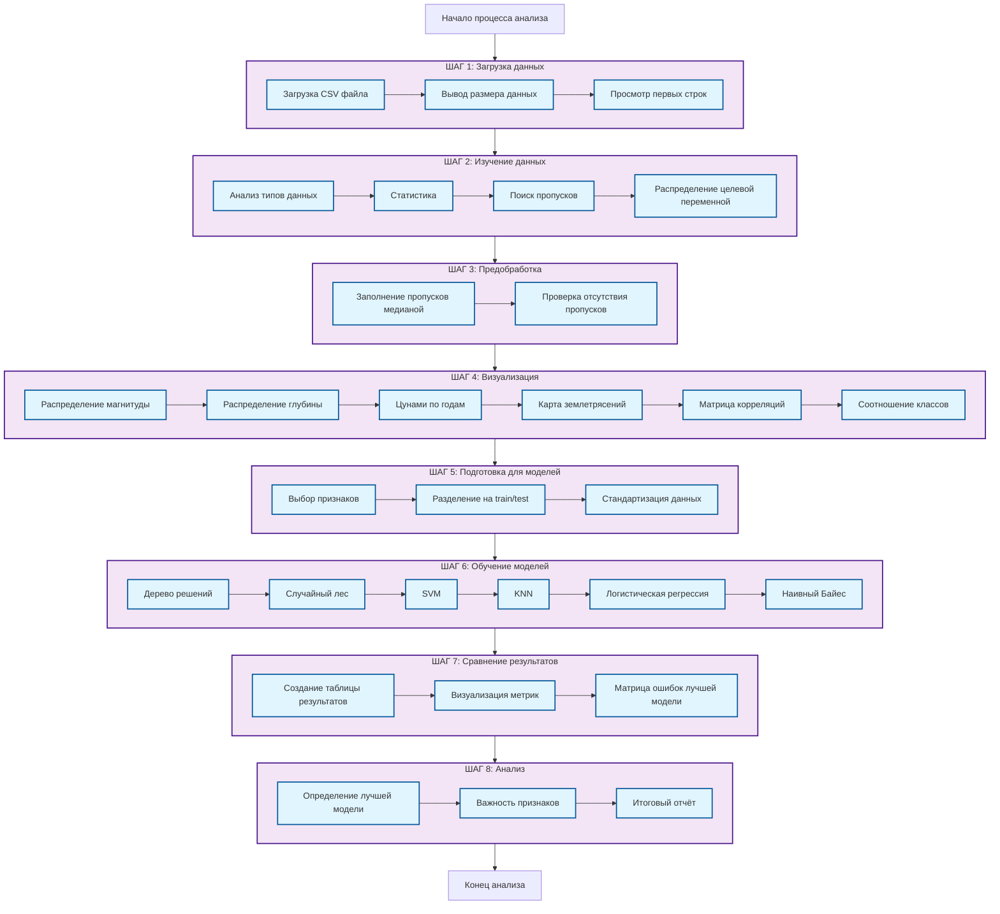

```mermaid
flowchart TD
    A[Начало процесса анализа] --> B
    
    subgraph B [ШАГ 1: Загрузка данных]
        B1[Загрузка CSV файла] --> B2[Вывод размера данных] --> B3[Просмотр первых строк]
    end
    
    B --> C
    
    subgraph C [ШАГ 2: Изучение данных]
        C1[Анализ типов данных] --> C2[Статистика] --> C3[Поиск пропусков] --> C4[Распределение целевой переменной]
    end
    
    C --> D
    
    subgraph D [ШАГ 3: Предобработка]
        D1[Заполнение пропусков медианой] --> D2[Проверка отсутствия пропусков]
    end
    
    D --> E
    
    subgraph E [ШАГ 4: Визуализация]
        E1[Распределение магнитуды] --> E2[Распределение глубины] --> E3[Цунами по годам]
        E3 --> E4[Карта землетрясений] --> E5[Матрица корреляций] --> E6[Соотношение классов]
    end
    
    E --> F
    
    subgraph F [ШАГ 5: Подготовка для моделей]
        F1[Выбор признаков] --> F2[Разделение на train/test] --> F3[Стандартизация данных]
    end
    
    F --> G
    
    subgraph G [ШАГ 6: Обучение моделей]
        G1[Дерево решений] --> G2[Случайный лес] --> G3[SVM]
        G3 --> G4[KNN] --> G5[Логистическая регрессия] --> G6[Наивный Байес]
    end
    
    G --> H
    
    subgraph H [ШАГ 7: Сравнение результатов]
        H1[Создание таблицы результатов] --> H2[Визуализация метрик] --> H3[Матрица ошибок лучшей модели]
    end
    
    H --> I
    
    subgraph I [ШАГ 8: Анализ]
        I1[Определение лучшей модели] --> I2[Важность признаков] --> I3[Итоговый отчёт]
    end
    
    I --> J[Конец анализа]
    
    %% Стилизация
    classDef process fill:#e1f5fe,stroke:#01579b,stroke-width:2px
    classDef step fill:#f3e5f5,stroke:#4a148c,stroke-width:2px
    class B,C,D,E,F,G,H,I step
    class B1,B2,B3,C1,C2,C3,C4,D1,D2,E1,E2,E3,E4,E5,E6,F1,F2,F3,G1,G2,G3,G4,G5,G6,H1,H2,H3,I1,I2,I3 process
```
